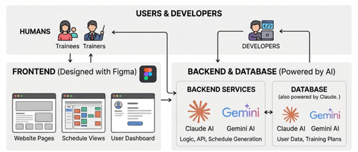

KIS Project – Proposal

**What is the high-level goal of your project and how to validate it?**
The high-level goal is for our website to produce a training schedule according to input parameters and to visualize it on the website. Additionally it should be downloadable as a pdf. 
This goal is validated if a User enters their data, selects a specific sport and receives a valid personalized training schedule (either online or downloaded).

**What system, feature or workflow will you develop or analyze?**

We will try to develop this website (front- and backend locally) including a user repository. From the registration / login to the start to the input-form to the output and download options. The user is then able to tick off completed exercises and trainings. It should be possible to alter the training schedule (add / remove trainings or exercises). 
For milestones, achievements will be granted.

**How does AI assistance contribute to the development process?**

It develops the whole project (with guidance from us). Claude, Gemini will be used for the backend and Figma Make will be utilised for the frontend.

 
**Project plan**
- Database (tentative deadline: 19.5.2026)
	- Users
	- Associated training schedules
	- Associated milestones
- AI component
	- System prompt
- Backend (tentative deadline: 25.5.2026)
	- Logic
	- Create form
	- Collect questions
	- Pass questions on to AI
	- Receive training schedule from AI
	- Integrate training schedule into website
	- Create milestones from training schedule (weekly)
	- Validate if milestones have been reached
- Frontend (tentative deadline: 27.5.2026)
	- GUI
		- Landing page
		- User dashboard
		- Training schedule aka. week planner

**Teamwork and responsibilities**
Estimated time: 13 – 15 hrs
We will both be working on the backend, the Database and the frontend, to ensure quality control and that we are both satisfied with the ai generated content.

